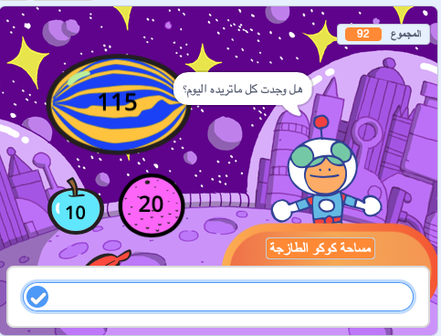

يمكنك استخدام لبنات `السؤال`{:class="block3sensing"} و `الجواب`{:class="block3sensing"} من قائمة لبنات`الاستشعار`{:class="block3sensing"} لإجراء محادثة.



إضافة لبنات الى المقطع البرمجي للكائن الذي`سيسأل`{:class="block3sensing"} سؤال:

```blocks3
ask [هل وجدت كل ما تريده اليوم؟] and wait
if <(answer) = [نعم]> then
say [هذا رائع!] for [2] seconds
else
say [ربما يجب علي إضافة المزيد من العناصر إلى متجري] for [2] seconds
end
```

**التصحيح:** تأكد من كتابة الخيارات بشكل صحيح في التعليمات البرمجية الخاصة بك وفي إجابتك. 

أضف أسئلة متعددة لإنشاء روبوت محادثة يمكنك التحدث إليها.

**نصيحة:** إذا قمت `بإخفاء`{:class="block3looks"} الكائن الذي يطرح سؤالاً ، فسيظهر السؤال داخل مربع الإدخال بدلاً من فقاعة كلام.


