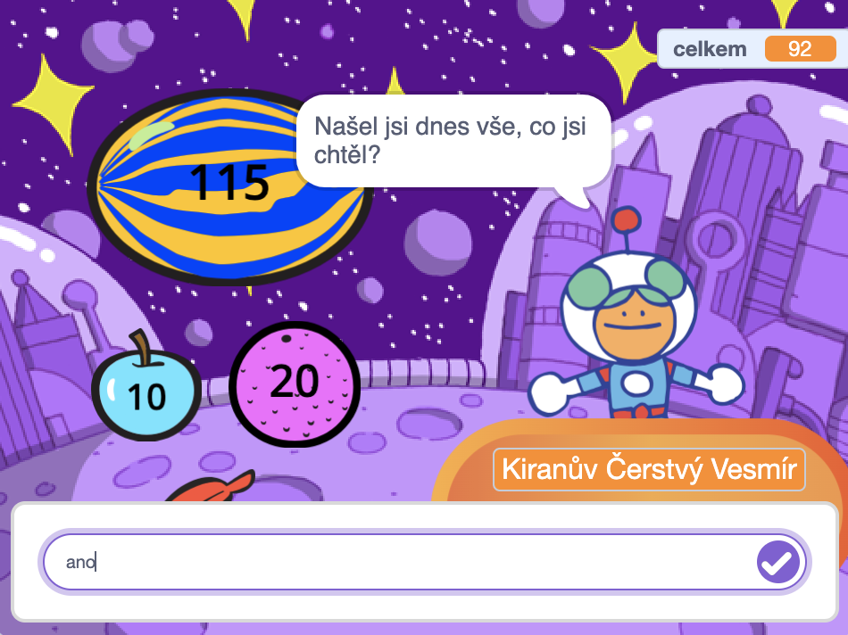
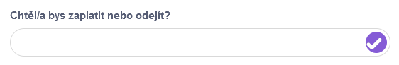

Ke konverzaci můžete použít bloky `otázka`{:class="block3sensing"} a `odpověď`{:class="block3sensing"} z nabídky bloků `Vnímání`{:class="block3sensing"}.



Přidejte bloky do skriptu na postavě, která položí `otázku`{:class="block3sensing"}:

```blocks3
ask [Našel jsi dnes vše, co jsi chtěl?] and wait
if <(answer) = [ano]> then
say [To je fantastické!] for [2] seconds
else
say [Možná bych měl přidat další zboží do svého obchodu] for [2] seconds
end
```

**Debugování:** Zkontrolujte, zda jste možnosti v kódu a ve své odpovědi napsali správně. Je v pořádku, pokud používáte velká písmena, takže „Ano“ a „ANO“ budou odpovídat „ano“.

Přidejte více otázek a vytvořte chatbota nebo nehrající postavu, se kterou můžete mluvit.

**Tip:** Pokud použijete `skryj se`{:class="block3looks"} pro postavu, která pokládá otázku, objeví se otázka ve vstupním poli místo jako bublina.



