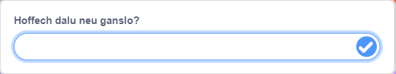

Galli di ddefnyddio'r blociau `gofyn`{:class="block3sensing"} ac `ateb`{:class="block3sensing"} o'r ddewislen blociau `Synhwyro`{:class="block3sensing"} i gael sgwrs.


Ychwanega'r blociau i sgript ar y corlun fydd yn `gofyn`{:class="block3sensing"} cwestiwn:

```blocks3
ask [Did you find everything you wanted today?] and wait
if <(answer) = [yes]> then
say [That's fantastic!] for [2] seconds
else
say [Maybe I should add more items to my shop] for [2] seconds
end
```

**Difa chwilod:** Gwna'n siŵr dy fod wedi sillafu'r opsiynau yn gywir yn dy god ac yn dy ateb. Mae'n iawn os wyt ti'n defnyddio priflythrennau, felly bydd "Do" a "DO" yn cyfateb i "do".

Ychwanega fwy nag un cwestiwn i greu bot sgwrsio neu gymeriad nad yw'n chwaraewr y galli di siarad ag ef.

**Awgrym:** Os wyt ti'n `cuddio`{:class="hide"} y corlun sy'n gofyn cwestiwn, yna bydd cwestiwn yn ymddangos y tu mewn i'r blwch mewnbwn yn lle fel swigen siarad.



