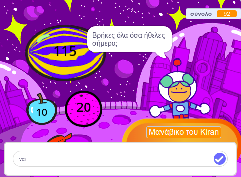
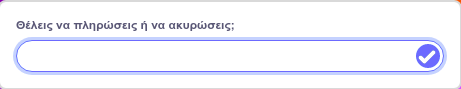

Μπορείς να χρησιμοποιήσεις τα μπλοκ `ερώτηση`{:class="block3sensing"} και `απάντηση`{:class="block3sensing"} από το μενού μπλοκ `Αισθητήρες`{:class="block3sensing"} ώστε να έχεις μια συνομιλία.



Πρόσθεσε μπλοκ στο script του αντικειμένου που θα κάνει μια `ερώτηση`{:class="block3sensing"}:

```blocks3
ask [Βρήκες όλα όσα ήθελες σήμερα;] and wait
if <(answer) = [ναι]> then
say [Αυτό είναι φανταστικό!] for [2] seconds
else
say [Ίσως θα έπρεπε να προσθέσω περισσότερα είδη στο κατάστημά μου] for [2] seconds
end
```

**Αποσφαλμάτωση:** Έλεγξε ότι έχεις γράψει σωστά τις επιλογές στον κώδικά σου και στην απάντησή σου. Δεν πειράζει αν χρησιμοποίησες κεφαλαία γράμματα, οπότε το "Ναι" και το "ΝΑΙ" θα ταιριάζουν με το "ναι".

Πρόσθεσε πολλές ερωτήσεις για να δημιουργήσεις έναν χαρακτήρα chatbot ή μη παίκτη με τον οποίο μπορείς να μιλήσεις.

**Συμβουλή:** Εάν `εξαφανίσεις`{:class="block3looks"}το αντικείμενο που κάνει μια ερώτηση, τότε η ερώτηση θα εμφανιστεί μέσα στο πλαίσιο εισαγωγής αντί ως συννεφάκι ομιλίας.



