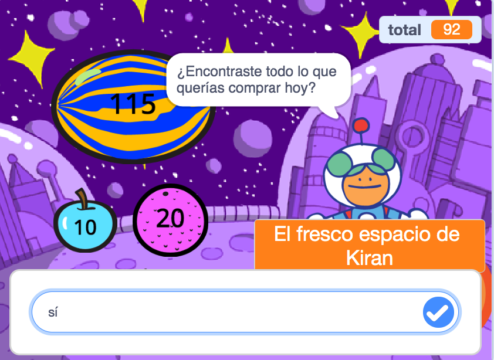
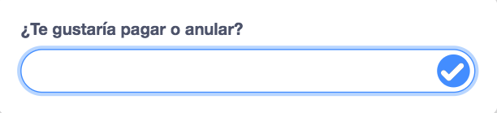

Puedes usar los bloques `preguntar`{:class="block3sensing"} y `respuesta`{:class="block3sensing"} del menú de bloques `Sensores`{:class="block3sensing"} para tener una conversación.



Agrega bloques a un script en el objeto que va a `preguntar`{:class="block3sensing"} algo:

```blocks3
ask [Did you find everything you wanted today?] and wait
if <(answer) = [yes]> then
say [That's fantastic!] for [2] seconds
else
say [Maybe I should add more items to my shop] for [2] seconds
end
```

**Depurar:** Comprueba que has escrito las opciones correctamente en tu código y en tu respuesta. Está bien si usas letras mayúsculas, por lo que "Sí" y "SI" coincidirán con "sí".

Agrega varias preguntas para crear un chatbot o un personaje no jugador con el que puedas hablar.

**Tip:** If you `hide`{:class="block3looks"} the sprite that asks a question, then question will appear inside the input box instead of as a speech bubble.



