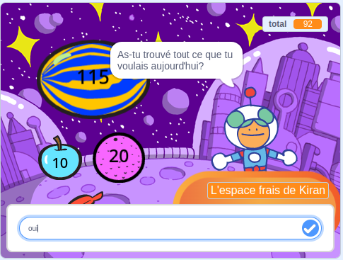
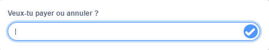

Tu peux utiliser les blocs `demander`{:class="block3sensing"} et `réponse`{:class="block3sensing"} du menu des blocs `capteurs`{:class="block3sensing"} pour avoir une conversation.



Ajoute des blocs à un script sur le sprite pour `demander`{: class = "block3sensing"} une question :

```blocks3
ask [Did you find everything you wanted today?] and wait
if <(answer) = [yes]> then
say [That's fantastic!] for [2] seconds
else
say [Maybe I should add more items to my shop] for [2] seconds
end
```

**Debug :** Vérifie que tu as correctement orthographié les options dans ton code et dans ta réponse. Ce n'est pas grave si tu utilises des majuscules, donc « Oui » et « OUI » correspondront à « oui ».

Ajoute plusieurs questions pour créer un chatbot ou un personnage non-joueur avec qui tu peux parler.

**Astuce :** Si tu `caches`{:class="hide"} le sprite qui pose une question, alors la question apparaîtra à l'intérieur de la zone de saisie au lieu d'être sous forme de bulle de dialogue.



