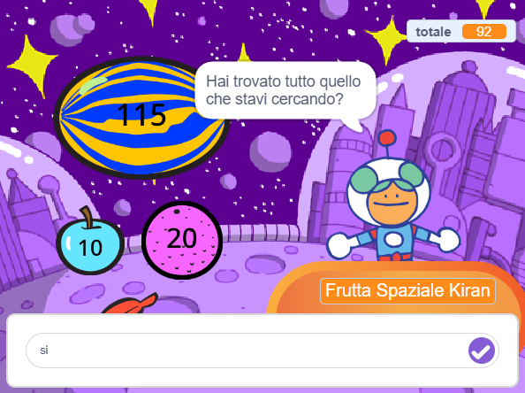

Puoi usare i blocchi `chiedi`{:class="block3sensing"} e `risposta`{:class="block3sensing"} dal menu dei blocchi `Sensori`{:class="block3sensing"} per avere una conversazione.



Aggiungi i blocchi a uno script sullo sprite per utilizzare il blocco `chiedi`{:class="block3sensing"} e fare una domanda:

```blocks3
ask [Hai trovato tutto quello che stavi cercando?] and wait
if <(answer) = [sì]> then
say [Fantastico!] for [2] seconds
else
say [Forse dovrei aggiungere più articoli al mio negozio] for [2] seconds
end
```

**Debug:** controlla di aver scritto correttamente le opzioni nel tuo codice e nella tua risposta. Puoi utilizzare anche le lettere maiuscole. Ad esempio, "Sì" e "SÌ" corrisponderanno a "sì".

Aggiungi più domande per creare un chatbot o un personaggio non giocante con cui puoi parlare.

**Suggerimento:** se `nascondi`{:class="block3looks"} lo sprite che fa la domanda, questa comparirà direttamente nella casella di testo invece che in un fumetto.


