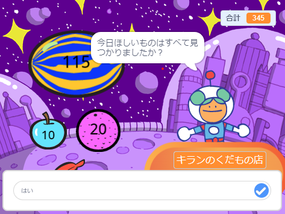

You can use the `ask`{:class="block3sensing"} and `answer`{:class="block3sensing"} blocks from the `Sensing`{:class="block3sensing"} blocks menu to have a conversation.



Add blocks to a script on the sprite that will `ask`{:class="block3sensing"} a question:

```blocks3
ask [Did you find everything you wanted today?] and wait
if <(answer) = [yes]> then
say [That's fantastic!] for [2] seconds
else
say [Maybe I should add more items to my shop] for [2] seconds
end
```

**Debug:** Check that you have spelled the options correctly in your code and in your answer. It's okay if you use capital letters, so "Yes" and "YES" will match "yes".

Add multiple questions to create a chatbot or non-player character that you can talk to.

**Tip:** If you `hide`{:class="block3looks"} the sprite that asks a question, then question will appear inside the input box instead of as a speech bubble.


