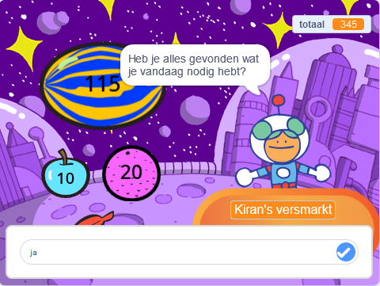
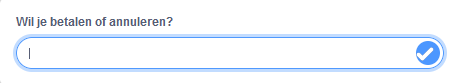

Je kunt de `vraag`{:class="block3sensing"} en `antwoord`{:class="block3sensing"} blokken uit het `Waarnemen`{:class="block3sensing"} blokkenmenu gebruiken om een gesprek te voeren.



Voeg blokken toe aan een script op de sprite die een `vraag`{:class="block3sensing"} wil stellen:

```blocks3
ask [Heb je alles gevonden wat je vandaag nodig hebt?] and wait
if <(answer) = [ja]> then
say [Dat is fantastisch!] for [2] seconds
else
say [Misschien moet ik meer items aan mijn winkel toevoegen] for [2] seconds
end
```

**Fouten opsporen:** Controleer of je de opties in je code en in je antwoord correct hebt gespeld. Het is niet erg als je hoofdletters gebruikt, dus "Ja" en "JA" zullen overeenkomen met "ja".

Voeg meerdere vragen toe om een chatbot of een "niet-speler karakter" te maken waarmee je kunt praten.

**Tip:** Als je de sprite die een vraag stelt op `verdwijn`{:class="block3looks"} instelt, dan verschijnt de vraag in het invoerveld in plaats van als een tekstballon.



