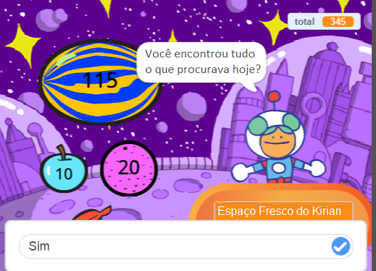
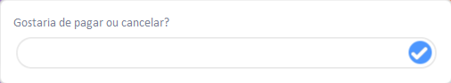

Você pode usar os blocos `pergunte`{:class="block3sensing"} e `responda`{:class="block3sensing"} na categoria `Sensores`{:class="block3sensing"} para criar conversas.



Adicione blocos a um script, no ator que irá fazer uma `pergunta`{:class="block3sensing"}:

```blocks3
ask [Did you find everything you wanted today?] and wait
if <(answer) = [yes]> then
say [That's fantastic!] for [2] seconds
else
say [Maybe I should add more items to my shop] for [2] seconds
end
```

**Depuração:** verifique se você digitou corretamente as opções em seu código e em sua resposta. Tudo bem se você usar letras maiúsculas, assim "Sim" e "SIM" corresponderão a "sim".

Adicione várias perguntas para criar um chatbot ou um personagem não jogável com quem você possa conversar.

**Dica:** Se você `esconde`{:class="block3looks"} o ator que faz uma pergunta, ela aparecerá dentro de uma caixa de entrada em vez de um balão de fala.



