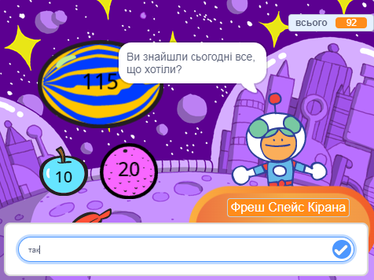
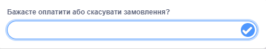

Ти можеш використовувати блоки `запитати`{:class="block3sensing"} та `відповідь`{:class="block3sensing"} з меню блоків `Датчики`{:class="block3sensing"}, щоб створити розмову.



Додай блоки до скрипту на спрайті, які будуть задавати `запитати`{:class="block3sensing"}:

```blocks3
ask [Did you find everything you wanted today?] and wait
if <(answer) = [yes]> then
say [That's fantastic!] for [2] seconds
else
say [Maybe I should add more items to my shop] for [2] seconds
end
```

**Налагодження:** переконайся, що ти правильно вказав варіанти відповідей у своєму коді та у відповідях. Можна використовувати великі літери, тоді «Так» і «ТАК» будуть збігатися з «так».

Додай кілька запитань, щоб створити чат-бота або неігрового персонажа (Npc), з яким можна поспілкуватись.

**Порада:** якщо `сховати`{:class="block3looks"} спрайт, який задає питання, то питання з'явиться всередині поля введення, а не у вигляді мовної бульбашки.



